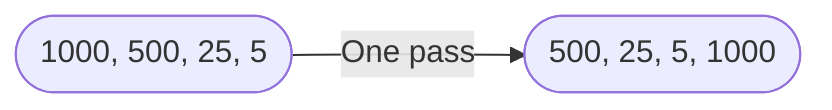
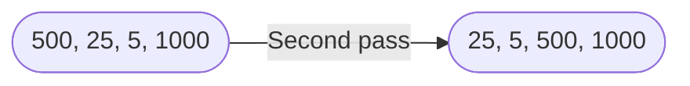
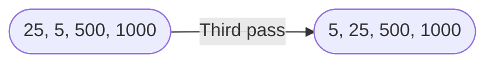

# Bubble Sort
> `Bubble sort is not only very easy to visualize what is happening, it is also only three lines of code` - The Michael Bublé-agen

Bubble sort is a very simple sorting algorithm and a great one to learn first. 

Bubble sort works by going through an array comparing the value of each element to its neighbor, and swapping the two if the one on the left is larger. Repeating this will eventually result in a sorted array. 

So why is it called "bubble" sort? When bubble sort passes through the array its first time, swapping larger elements to the right, the largest element of the array __bubbles__ up to the end. On the second pass the second largest element will __bubble__ up as well, and this continues until the array is sorted.

#### Example bubble sort with an initial array of [1000, 500, 25, 5]
  

The largest value 1,000 bubbled up to the end of the array. 

Now let's watch 500 bubble up on the second pass.


Now that the 500 has bubbled up, one more pass and the array is sorted.



As promised, here are the three lines of code powering bubble sort.

```python
# Bubble Sort
for i in range(len(arr)):
    for j in range((len(arr) - 1) - i):
        if arr[j] > arr[j + 1]: arr[j], arr[j + 1] = arr[j + 1], arr[j] 
```
Here is a commented version that explains each step.
```python
# For each element in arr
for i in range(len(arr)):
    # Go through the array until we hit the guaranteed largest values that bubbled up.
    for j in range(len(arr) - i - 1):
    # And when you find a node larger than its right side neighbor
        if arr[j] > arr[j + 1]: 
            # Swap them 
            swap(arr, j, j+1)

def swap(arr, larger_first_num_index, smaller_second_num_index):
    arr[larger_first_num_index], arr[smaller_second_num_index] = arr[smaller_second_num_index], arr[larger_first_num_index]
```
</details>  

#### Two Interesting Facts About Bubble Sort's Inner Loop

1. Since the last element on the first loop is guaranteed to be largest with our bubble operations, we subtract one from the inner loop. This means the first loop only has $n-1$ operations

2. Since each pass after the first one also has the largest elements bubbling to the end of the array, this means `i` is effectively your count of how many elements are already sorted at the end of the array. This also means that you can improve performance and exclude the sorted end by subtracting `i` from the inner loop. 

## Understanding Time Complexity

[Click here](running_time.md) to see my explanation of running time and Big O notation.

## Bubble Sort's Run Time

Bubble Sort is $O(n^2)$, making it inefficient for larger datasets, but why?

Bubble sort uses two loops based on the size of the array:

The outer loop goes through the whole list $n$ or `len(arr)`. The inner loop, which compares each pair of items and swaps them if needed, goes through the list until index `n-i-1`. 

Running these loops, the total number of comparisons made is

$(n-1) + (n-2) + (n-3) + \ldots + 1 = \frac{n(n-1)}{2}$

$\text{Total operations}=\frac{n(n-1)}{2}$

$\text{Big O}=\frac{n(n-1)}{2} = \frac{n^2 - n}{2} = \frac{n^2}{2} - \frac{n}{2} = O(n^2)$

### While bubble sort is rarely the best choice for large datasets or situations where performance is critical, understanding how to analyze its number of operations and determine its Big O growth rate gives you the tools to evaluate and compare it to other algorithms.

<br />

### Thanks for reading! 

---

### Explore More
#### Bubble Sort Implementation [📄 View Code](../../algorithms/bubble_sort.py)

#### Bubble Sort Tests  [📝 Run Tests](../../tests/algorithms/test_bubble_sort.py)
