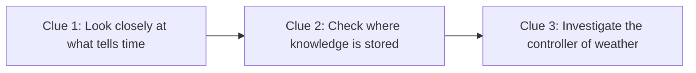
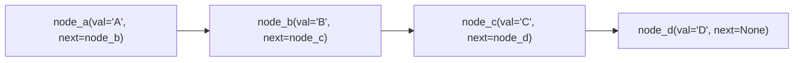
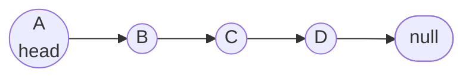
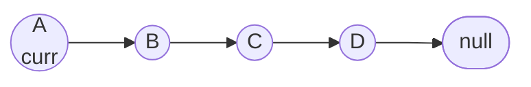
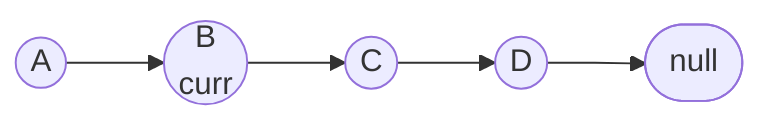
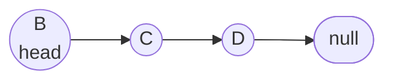

# Linked Lists 

`Linked lists are a node based data structure, no not "Node" as in the runtime for javascript, node as in the type of container that will wrap our data` - The Primeagen

Arrays are so fundamental that linked lists feel like the first data structure.

### Linked Lists as a Scavenger Hunt

An analogy to think of linked list is a scavenger hunt where each clue hints or points to the next item. 



If the clue was blank, the seekers wouldn't know how to get to the next item, and would assume the scavenger hunt is over.

Because each clue leads to the next, to insert a new clue requires to

1. Rewrite the previous clue to lead to the new clue.
2. Write the inserted clue to lead to the next clue.

Linked lists share lots of the same behavior.

### Linked Lists Defined

Instead of clues, a **linked list** is made up of **nodes**. Each **node** contains two things
1. `value`- which holds a value 
2. `next`- address that points you to the next node

Represented in a graph this looks like:



Even though a linked list is made up of nodes, it doesn't have access to values like an array does instantly with `arr[2]`. 

A linked list usually only stores `head` (the first node) and sometimes `tail` (the last node). This means to fetch any value from an index a linked list has to visit every node before that value to reach it. This makes index fetching an $O(n)$ time operation. Linked lists are probably not the data structure to use to fetch based on an index often.

But a *huge* advantage of linked lists is adding and removing from the beginning. Writing both of these is 4 lines of code and both are $O(1)$ operations. 

```python
# Remove from the beginning if head node exists
if ll.head is not None:
    ll.head = ll.head.next
# Adding new node to the beginning
new_node.next = ll.head
ll.head = new_node
```

Class definitions of Node and LinkedList
```python
class Node:
    def __init__(self, val):
        self.val = val
        self.next = None

class LinkedList:
    def __init__(self):
        self.head = None # Points to the first node of the list
```

### Traversing a Linked List

The most basic function of a linked list is to print out every node's value. The only way to traverse the linked list is through nodes one at a time, starting at the head and then going to head.next. If any node's next is empty, traversal is stopped.



For traversal we use the value `curr`, short for current, to start at the head. We assign `curr = head`, print out the value `print(curr.val)`.


Then, we use `curr.next` to travel to the next node and continue printing `while curr` exists.



We use `curr` because if we used `head` and ever called `head = head.next`, the list would lose Node A and would start at the second node!



Here is a normal traversal of a linked list.

```python
# Linked list traversal
curr = head
while curr:
    print(curr.val)
    curr = curr.next
```

### Why not arrays?

Why even create another data structure? What are the trade offs of using purely arrays?

#### The Cons of Arrays
1. You can't *really* delete, you can only write over
2. You can't *really* insert, you can only write
3. Pure arrays are ungrowable, because all space is allocated at creation.

Linked lists actually solve these specific pains and make growing and shrinking to your data a lot easier.

#### The Pros of Linked lists
1. You can truly delete from the beginning, middle, or end
2. You can actually insert another value in the middle
3. Creation at start or end is simple and constant time

#### Linked Lists vs Arrays¹

| Operation                   | Array | Linked List |
|-----------------------------|:-----:|:-----------:|
| Accessing the nth element   | O(1)  | O(n)        |
| Inserting an element        | O(n)  | O(1)        |
| Removing an element         | O(n)  | O(1)        |
| Determining the size        | O(1)  | O(n)        |

[Click here](running_time.md) to see my explanation of Big O notation and running time.

## Doubly-Linked Lists

A doubly-linked list is a linked list that lets you go both ways from any node, traverse forward and backward. Notice the added `prev` field in the node and `tail` in the linked list.

```python
# doubly_linked_list_node type
val: Type
next: Node[Type] | None
prev: Node[Type] | None

# doubly_linked_list type
head: Node[Type] | None
tail: Node[Type] | None
```

The advantage of doubly-linked lists is making creation and deletion at the end $O(1)$. This is because the doubly-linked list keeps track of tail and can walk backwards from it.

The trade-off of using a doubly-linked list is that each node needs a little more memory for the previous node.

#### Significance of Linked Lists

Common real-world uses of linked lists
- Text editor undo/redo functions
- Browser history back/forward buttons

### While pure linked lists are not widely used in the real world, a linked list when used in combination with other data structures can provide its unique benefits and help negate other data structures' weaknesses!

<br />

--- 

### Explore More
#### Linked List Implementation [📄 View Code](../../data_structures/linked_list.py)

#### Linked List Tests  [📝 View Tests](../../tests/data_structures/test_linked_lists.py)

### Sources

 [¹] _Table Source: [HappyCoders.eu – Array vs. Linked List – Time Complexity](https://www.happycoders.eu/algorithms/array-vs-linked-list/#time-complexity-overview)_


