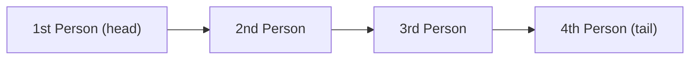

# Queue

`"A queue is just a specific implementation of a linked list."` - The Primeagen

A **queue** is a data structure that implements First In First Out (FIFO) behavior. It is usually built on top of a linked list, but queues can also be built on top of other data structures like arrays.  

Queues are very limited in their behavior compared to arrays and linked lists. There are only two operations possible that manipulate data with a queue:

- **enqueue** – Add an element to the end (tail) of the queue.
- **dequeue** – Remove and return the element from the front (head) of the queue.

Queues sometimes have these methods that don't manipulate data:
- **peek** - Returns the first element of the queue 
- **is_empty** - Returns boolean `true` if the queue is empty and `false` if not

#### Queues as a Line for a Roller Coaster 🎢

When waiting in a line at a roller coaster, the people that were first to get there are first to board the roller coaster. 


Now, we all agree to constrain ourselves while in a roller coaster line that the first person to arrive is the first person to board. Even if one person was only half a second quicker, and the person behind them has to wait five minutes longer, we constrain ourselves to these operations.

Programmatically, we enforce these conditions in queues. We only allow those two operations, entering the queue at the end (enqueue) and leaving the queue from the front (dequeue).

The British  actually use the word **queue** to describe waiting lines for roller coasters or grocery stores! It makes a lot of sense, and to quickly remember the behavior of queues I always think of this British usage. Biscuits and tea ☕

#### Queue Operations

For a queue we only track two pointers, **head** and **tail** (start and end) and we only need to define the two methods **enqueue** (add to end) and **dequeue** (remove from start):

Here is both methods psuedo cose (without factoring edge cases and head/tail updates). 
```py
def enqueue(value):
    new_node = Node(value)
    tail.next = new_node
    tail = new_node

def dequeue():
    first_out = head
    head = head.next
    first_out.next = None
    return first_out.val
```

#### Constrained for Performance

Linked lists commonly have methods to find elements at certain indexes, insert at different indexes, and remove from indexes.
Since queues only allow two operations, removing from start and adding to the end, every operation is guaranteed to run in $O(1)$ time.

#### Running time of Queue vs Linked List vs Array¹

| Operation                  | Array | Linked List | Queue               |
|-----------------------------|:-----:|:-----------:|:-------------------:|
| Accessing the nth element   | O(1)  | O(n)        | Not allowed         |
| Inserting an element        | O(n)  | O(1)        | O(1) |
| Removing an element         | O(n)  | O(1)        | O(1) |
| Determining the size        | O(1)  | O(n)        | Not allowed         |


*[Click here](running_time.md) to see my explanation of Big O notation and running time.*

See above how queues are strategically constrained for performance.

#### Significance of Queues

Queues are used in 
- Video buffering for Netflix or YouTube - which is why a network can suddenly go out and the video still plays the from the queue
- Printers - printers will perform printing jobs in the order received

#### In short, queues are used everywhere in the real world, and are a useful data structure to keep in mind when facing problems of more producing than consuming and where waiting in the order of arrival is required. 

<br />

--- 

### Explore More
#### Queue Implementation [📄 View Code](../../data_structures/MyQueue.py)

#### Queue Tests  [📝 View Tests](../../tests/data_structures/test_queue.py)


### Sources

 [¹] _Original Table Source: [HappyCoders.eu – Array vs. Linked List – Time Complexity](https://www.happycoders.eu/algorithms/array-vs-linked-list/#time-complexity-overview)_


